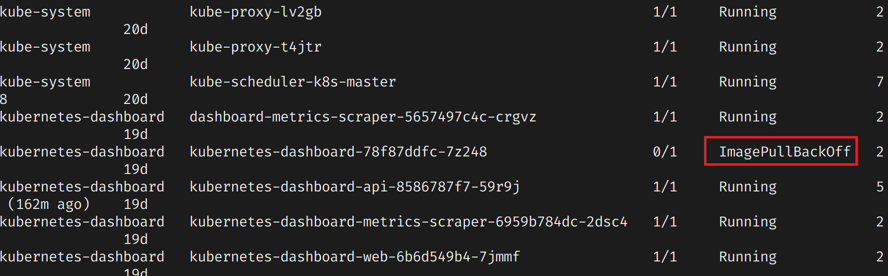

# 錯誤訊息: ImagePullBackOff

```shell
# 查看所有pods狀態
kubectl get pods --all-namespaces
```
  

```shell
# 查看該Pod的描述
kubectl describe pod kubernetes-dashboard-78f87ddfc-7z248 --namespace=kubernetes-dashboard
```
 

 發現原因是因為無法解析到外部https://quay.io, 經查看原來是我的VM無法連到internet,排除後正常。

 