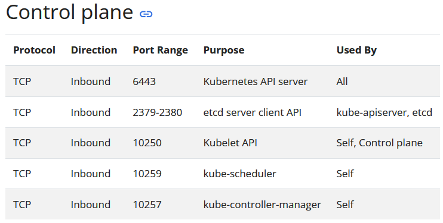
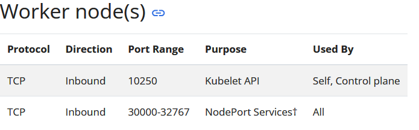
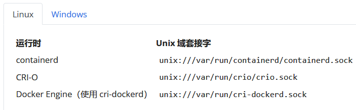
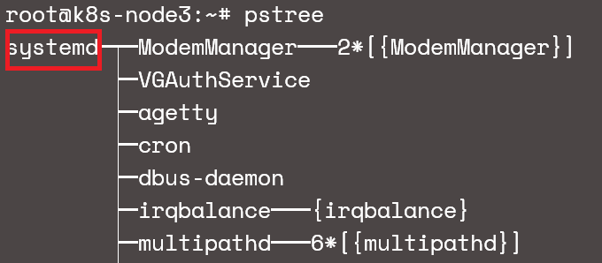
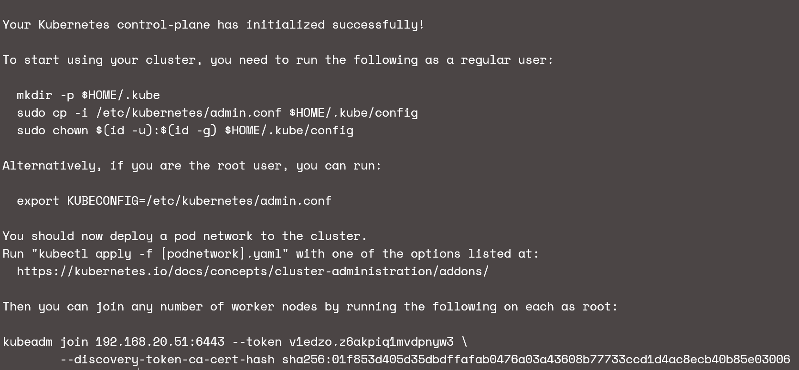
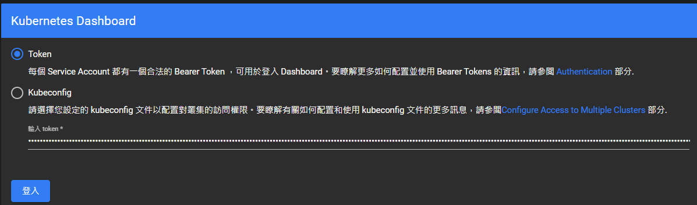

<h1 align=center>安裝kubernetes cluster</h1>

<h2>安裝前準備</h2>

  * Linux 主機, Kubernetes有為Debian、Ubuntu、RedHat等提供通用的指令。
  * 每台主機至少2GB以上的記憶體。
  * 每台主機至少有CPU 2 core以上。
  * 各主機之間的網路能互相溝通。
  * 各主機要有唯一的主機名稱、MAC、Product_uuid(可用sudo cat /sys/class/dmi/id/product_uuid查看)
  * 開啟必要的port number。
    
    <h4 align=center>control plane 所使用的Port</h4>

    
    <h4 align=center>work node 所使用的Port</h4>

  * 如有開啟swap 分割區, 要先關閉。

  <h2>主機資訊</h2>

  | Host Name |  IP address  | Role |
  |-----------|--------------|------|
  | k8s-master| 192.168.20.51|Master|
  | k8s-node1 | 192.168.20.52|Node  |
  | k8s-node2 | 192.168.20.53|Node  |
  | k8s-node3 | 192.168.20.54|Node  |

  <h2>swap off</h2>
  
  ```shell
  # swapoff -a

  ***編輯/etc/fstab,並註解掉swap.img使其重開機後不會再掛載swap 分割區***

  # vim /etc/fstab   

  ```

  <h2>Container Runtime</h2>

  為了在Pod運行容器, Kubernetes會使用Container Runtime, 所有的node都需安裝Container Runtime。
  預設情況下, Kubernetes透過CRI(Container Runtime Interface), 來與你選的Container Runtime互動。
  下列為已支援CRI的Container Runtime:
  
    <h4 align=center>已支援CRI的Container Runtime</h4>

<h2>安裝Container Runtime</h2>
安裝前需要轉發IPv4並讓iptables能看到橋接流量

```shell
cat <<EOF | sudo tee /etc/modules-load.d/k8s.conf
overlay
br_netfilter
EOF

sudo modprobe overlay
sudo modprobe br_netfilter

###設置所需的sysctl參數, 參數在重啟後保持不變
cat <<EOF | sudo tee /etc/sysctl.d/k8s.conf
net.bridge.bridge-nf-call-iptables  = 1
net.bridge.bridge-nf-call-ip6tables = 1
net.ipv4.ip_forward                 = 1
EOF

###直接啟用而無需重啟
sudo sysctl --system

###確認overlay、br_netfilter模組已經載入且運行
lsmod | grep br_netfilter
lsmod | grep overlay

###確認net.bridge.bridge-nf-call-iptables、net.bridge.bridge-nf-call-ip6tables、net.ipv4.ip_forward的值已經改為1
sysctl net.bridge.bridge-nf-call-iptables net.bridge.bridge-nf-call-ip6tables net.ipv4.ip_forward

###Export所需要版本的變數名稱, 選擇以CRI-O作為Container Runtime
export OS='xUbuntu_22.04'
export VERSION='1.28'

#加入apt source list來使用apt下載預編譯完成的cri-o、cri-o-runc(runc為負責底層建立、啟動及Container行程工具, runc也有c實作的版本,cri-o-runc則是go實作的版本)
echo "deb [signed-by=/usr/share/keyrings/libcontainers-archive-keyring.gpg] https://download.opensuse.org/repositories/devel:/kubic:/libcontainers:/stable/$OS/ /" > /etc/apt/sources.list.d/devel:kubic:libcontainers:stable.list

echo "deb [signed-by=/usr/share/keyrings/libcontainers-crio-archive-keyring.gpg] https://download.opensuse.org/repositories/devel:/kubic:/libcontainers:/stable:/cri-o:/$VERSION/$OS/ /" > /etc/apt/sources.list.d/devel:kubic:libcontainers:stable:cri-o:$VERSION.list

mkdir -p /usr/share/keyrings
curl -L https://download.opensuse.org/repositories/devel:/kubic:/libcontainers:/stable/$OS/Release.key | gpg --dearmor -o /usr/share/keyrings/libcontainers-archive-keyring.gpg
curl -L https://download.opensuse.org/repositories/devel:/kubic:/libcontainers:/stable:/cri-o:/$VERSION/$OS/Release.key | gpg --dearmor -o /usr/share/keyrings/libcontainers-crio-archive-keyring.gpg

apt-get update
apt-get install cri-o cri-o-runc

##啟動cri-o
systemctl daemon-reload
systemctl enable crio
systemctl start crio
```

<h2>cgroup drivers</h2>
cgroup(control groups)是linux用來限制所分配行程的資源。
有二種cgroup drivers可用:

 * cgroupfs 
 * systemd

如果你的Linux是以systemd作為初始化系統時, 不建議使用cgroupfs, 或是使用cgrop v2都應使用systemd cgroup driver來取代cgroupfs。
確認你的linux環境使用那一種cgroup driver:

    <h4 align=center>使用ptree確認是systemd或init</h4>

```shell
###要設置systemd作為cgroup driver需要在KubeletConfiguration的cgroupDriver選項設為systemd。
---註: 從v1.22開始,使用kubeadm來創建cluster,不用再將KubeletConfiguration的cgroupDriver選項設為systemd,預設即為systemd, 若以CRI-O作為container runtime預設也是使用systemd cgroup driver。

$ stat -fc %T /sys/fs/cgroup/
cgroup2fs #表示為cgroup v2
```

<h2>重載沙箱的Pause鏡像</h2>

```shell
/*
在一個pod中可能會有一個以上的容器, 
而這些容器在pod之間共享儲存和網路資源,
假如有二個容器A、B要共享網路,
不論是那一個加入對方的network namespace,
都有可能一方退出而導致其它容器異常, 因此
使用pause容器來作為第三方容器,都可保持網路穏定。
*/

###編輯/etc/crio/crio.conf
[crio.image]
pause_image="registry.k8s.io/pause:3.6"

$ systemctl reload crio
```

<h2>安裝kubeadm、kubelet、kubectl</h2>

你需要在每台機器安裝以下套件包:
* kubeadm: 用來初始化cluster的指令。
* kubelet: 在cluster中的每個節點啟動pod和容器等。
* kubectl: 用來與cluster通信的command line工具。

要注意的是各套件彼此間的版本匹配性, kubelet與api server版本可以存在一個次要版本差異,
例如: 1.7.0版的kubelet可以相容1.8.0版的api server, 反之不行。

```shell
###更新apt及安裝所需deb包
apt update
apt install -y apt-transport-https

###下載kubenetes公共簽名密鑰
curl -fsSL https://pkgs.k8s.io/core:/stable:/v1.29/deb/Release.key | sudo gpg --dearmor -o /etc/apt/keyrings/kubernetes-apt-keyring.gpg

###加入apt source
echo 'deb [signed-by=/etc/apt/keyrings/kubernetes-apt-keyring.gpg] https://pkgs.k8s.io/core:/stable:/v1.29/deb/ /' | sudo tee /etc/apt/sources.list.d/kubernetes.list

###更新並安裝套件包, 且將版本鎖定
apt update
sudo apt install -y kubelet kubeadm kubectl
apt-mark hold kubelet kubeadm kubectl
```

<h2>初始化master節點</h2>

control-plane節點是運作etcd、apiserver的機器, 以kubeadm init <args>來初始化。
* 如果master節點有作HA, 可加入--control-plane-endpoint作為所有master共享端點。
* 依所選取的overlayer network設定--pod-network-cidr, 例如選Calico: 192.168.0.0/16
* 另外還有--cri-socket這個選項, 基本上如你有安裝CRI了會自動偵測, 不用設定。

```shell
kubeadm init --apiserver-advertise-address=192.168.20.51 --pod-network-cidr=192.168.0.0/16
###順利的話安裝最後會出現initialized successfully!訊息
``````

    <h4 align=center>kubeadm init</h4>

```shell
###如果是非root使用者, 要開始使用cluster加上下面操作
mkdir -p $HOME/.kube
sudo cp -i /etc/kubernetes/admin.conf $HOME/.kube/config
sudo chown $(id -u):$(id -g) $HOME/.kube/config

###記錄剛kubeadm init產生的最後訊息, NODE加入cluster就是使用它來加入
kubeadm join 192.168.20.51:6443 --token v1edzo.z6akpiq1mvdpnyw3 \
        --discovery-token-ca-cert-hash sha256:01f853d405d35dbdffafab0476a03a43608b77733ccd1d4ac8ecb40b85e03006
```

<h2>安裝pod 網路附加組件</h2>

每個組件安裝方法不同, 參照[官方參考列表](https://kubernetes.io/docs/concepts/cluster-administration/addons/)

安裝Calico
```shell
kubectl create -f https://raw.githubusercontent.com/projectcalico/calico/v3.27.0/manifests/tigera-operator.yaml

kubectl create -f https://raw.githubusercontent.com/projectcalico/calico/v3.27.0/manifests/custom-resources.yaml

watch kubectl get pods -n calico-system
####等所有狀態都為Running才算完成
Every 2.0s: kubectl get pods -n calico-system                                           k8s-master: Sun Dec 31 09:04:57 2023

NAME                                       READY   STATUS    RESTARTS   AGE
calico-kube-controllers-7dd4c4ff4f-w9rhl   1/1     Running   0          13m
calico-node-5sp6q                          1/1     Running   0          13m
calico-typha-5b4f54bdd4-5c6lq              1/1     Running   0          13m
csi-node-driver-lv6jn                      2/2     Running   0          13m

###其中control-plane為1.19以後所出現的角色, 1.18以前則為master
###出於安全原因, 不會在control-plane節點運行pod, 如果要的話, 執行下列:
kubectl taint nodes --all node-role.kubernetes.io/control-plane-
kubectl taint nodes --all node-role.kubernetes.io/master-
###應會出現untainted訊息
node/k8s-master untainted

kubectl get nodes -o wide
###應該看得到已經ready的node了
NAME         STATUS   ROLES           AGE   VERSION   INTERNAL-IP     EXTERNAL-IP   OS-IMAGE             KERNEL-VERSION      CONTAINER-RUNTIME
k8s-master   Ready    control-plane   52m   v1.29.0   192.168.20.51   <none>        Ubuntu 22.04.3 LTS   5.15.0-91-generic   cri-o://1.28.2
```

<h2>加入節點</h2>

現在可以將各個工作節點加入到cluster了
```shell
###登入各台工作節點, 並以root身份登入, 將剛剛kubeadm init最後那一行複制貼上
kubeadm join 192.168.20.51:6443 --token v1edzo.z6akpiq1mvdpnyw3 \
        --discovery-token-ca-cert-hash sha256:01f853d405d35dbdffafab0476a03a43608b77733ccd1d4ac8ecb40b85e03006

###如果剛沒複製可以list token
kubeadm token list

###但如果你的token已超過24小時就會失效了, 要重新產生
kubeadm token create

###如果沒有--discovery-token-ca-cert-hash, 用下面方式產生
openssl x509 -pubkey -in /etc/kubernetes/pki/ca.crt | openssl rsa -pubin -outform der 2>/dev/null | \
   openssl dgst -sha256 -hex | sed 's/^.* //'

###由於預設工作節點的ROLES為NONE,所以要為工作節點打上角色標籤
kubectl label nodes k8s-node1 kubernetes.io/role=worker
kubectl label nodes k8s-node2 kubernetes.io/role=worker
kubectl label nodes k8s-node3 kubernetes.io/role=worker

kubectl get nodes

NAME         STATUS   ROLES           AGE   VERSION
k8s-master   Ready    control-plane   79m   v1.29.0
k8s-node1    Ready    worker          20m   v1.29.0
k8s-node2    Ready    worker          20m   v1.29.0
k8s-node3    Ready    worker          19m   v1.29.0
```

<h2>etcd 安裝 (若有需要另用外部etcd) </h2>

```shell
### 注意: 在Production環境中, 最低版本3.4.22+ 和3.5.6+。
### 首先，安裝 etcd。
export RELEASE=$(curl -s https://api.github.com/repos/etcd-io/etcd/releases/latest | grep tag_name | cut -d '"' -f 4)
wget https://github.com/etcd-io/etcd/releases/download/${RELEASE}/etcd-${RELEASE}-linux-amd64.tar.gz

### 解壓縮下載的檔案
tar xvf etcd-${RELEASE}-linux-amd64.tar.gz
cd etcd-${RELEASE}-linux-amd64

### 將etcd binary檔搬至/usr/local/bin/
sudo mv etcd etcdctl etcdutl /usr/local/bin/

### 確認版本
etcd --version
etcdctl version

### 建立設定檔及資料檔的目錄
sudo mkdir -p /var/lib/etcd/
sudo mkdir /etc/etcd

### 建立etcd 系統用戶
sudo groupadd --system etcd
sudo useradd -s /sbin/nologin --system -g etcd etcd
sudo chown -R etcd:etcd /var/lib/etcd/

### 建立一個systemd服務檔來管理etcd服務
sudo vi /etc/systemd/system/etcd.service
如下面內容

[Unit]
Description=etcd key-value store
Documentation=https://github.com/etcd-io/etcd
After=network.target

[Service]
User=etcd
Type=notify
Environment=ETCD_DATA_DIR=/var/lib/etcd
Environment=ETCD_NAME=%m
ExecStart=/usr/local/bin/etcd
Restart=always
RestartSec=10s
LimitNOFILE=40000

[Install]
WantedBy=multi-user.target

### 啟動並啟用etcd服務
sudo systemctl daemon-reload
sudo systemctl start etcd
sudo systemctl enable etcd


### 檢查etcd服務狀態
sudo systemctl status etcd

### 測試etcd服務
edwin@k8s-master:~$ etcdctl --endpoints=localhost:2379 put foo bar
OK

edwin@k8s-master:~$ etcdctl --endpoints=localhost:2379 get foo
foo
bar

```

<h2>Kubernetes Dashboard</h2>

Kubernetes提供了一個網頁GUI介面, 可以用來管理cluster 資源和獲得一些訊息, 預設下不會自動部署Dashboard, 因此要手動部署, 可以透過下列方式:
```shell
###部署kubernetes dashboard
kubectl apply -f https://raw.githubusercontent.com/kubernetes/dashboard/v2.7.0/aio/deploy/recommended.yaml

###建立account for dashboard
kubectl apply -f dashboard-adminuser.yaml

/*
#-----dashboard-adminuser.yaml-------#
apiVersion: v1
kind: ServiceAccount
metadata:
  name: admin-user
  namespace: kubernetes-dashboard

---

apiVersion: v1
kind: Secret
metadata:
  name: admin-user
  namespace: kubernetes-dashboard
  annotations:
    kubernetes.io/service-account.name: "admin-user"   
type: kubernetes.io/service-account-token  

---

apiVersion: rbac.authorization.k8s.io/v1
kind: ClusterRoleBinding
metadata:
  name: admin-user
roleRef:
  apiGroup: rbac.authorization.k8s.io
  kind: ClusterRole
  name: cluster-admin
subjects:
- kind: ServiceAccount
  name: admin-user
  namespace: kubernetes-dashboard
*/

###在你的本機端執行, 透proxy方式來連入dashboard
kubectl proxy

###產生一個token來登入dashboard, 可加--duration=0s指定存活時間
kubectl -n kubernetes-dashboard create token admin-user

###建立一個長期有效的token
kubectl get secret admin-user -n kubernetes-dashboard -o jsonpath={".data.token"} | base64 -d

###如需要刪除admin user
kubectl -n kubernetes-dashboard delete serviceaccount admin-user
kubectl -n kubernetes-dashboard delete clusterrolebinding admin-user

```

    <h4 align=center>使用token 來login</h4>

