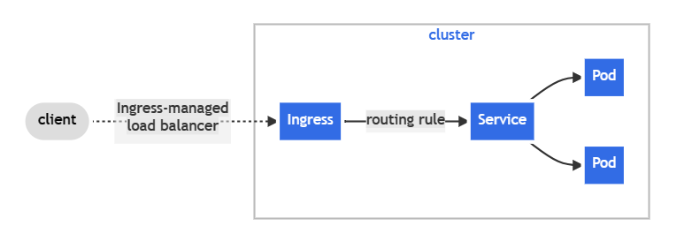

<h1 align=center>試玩Kubernetes</h1>

<h2>mknikube</h2>
minikube是可以用來在本機上安裝, 並用於學習kubenetes的工具。

* <h3>事前環境準備</h3>
  
  * 2 CPUs 或以上。
  * 2GB 以上記憶體
  * 20GB 以上磁碟空間
  * 可以連上internet
  * Container 或虛擬機器, 例如: Docker、VirtualBox、Vmware Workstation等

***安裝***

可以在windows 或mac OS以及linux環境中架設, 下列以windows方式安裝。

PowerShell
```shell
$New-Item -Path 'd:\' -Name 'minikube' -ItemType Directory -Force
$Invoke-WebRequest -OutFile 'd:\minikube\minikube.exe' -Uri 'https://github.com/kubernetes/minikube/releases/latest/download/minikube-windows-amd64.exe' -UseBasicParsing
```

將minikube.exe 加進PATH(注意: 你的powershell須具有administrator權限)

```shell 
$oldPath = [Environment]::GetEnvironmentVariable('Path', [EnvironmentVariableTarget]::Machine)
if ($oldPath.Split(';') -inotcontains 'C:\minikube'){
  [Environment]::SetEnvironmentVariable('Path', $('{0};C:\minikube' -f $oldPath), [EnvironmentVariableTarget]::Machine)
}
```
另外如果使用VMware workstation, 確認vmrun.exe是否已被加入Path, minikube會需要使用它來控制虛擬機。

***啟動kubenetes cluster***

```shell
  $minikube start --driver vmware
```

***和kubenetes cluster互動***

如果本地端沒有安裝kubectl(註: 一種命令列工具, 用以呼叫kubenetes API, 可用於管理、部署)的話, 可用以下方法替代:

```shell
  $minikube kubectl -- get po -A
```

minikube也有裝上dashboard, 可以讓你了解目前cluster狀態及一些設定, 使用下面方法啟動:

```shell
  $minikube dashboard
```

***部署應用***

 * Service

   Service(服務): 是一種將一個或多個Pod將網路曝露出來供外部client存取的一種方法。 
   
   以下建立一個部署並將port 8080給曝露出來。
   ```shell
     $minikube kubectl -- create deployment hello-minikube --image kicbase/echo-server:1.0
     $minikube kubectl -- expose deployment hello-minikube --type NodePort --port 8080
   ```

   列出服務應可看到已部署的hello-minikube

   ```shell
     $minikube kubectl -- get services
   ```

  另外可以用port forward方式將pod forward出來:

  ```shell
    $minikube kubectl -- get pod
    $minikube kubectl -- port-forward hello-minikube-59d4768566-tg7lq 9000:8080
  ```
  這樣應該可以在本機localhost:9000開啟瀏覽器看到了。
  
  * LoadBalancer

     kubenetes本身並不提供負載平衡, 須由外部提供或安裝插件。

  ```shell
    $minikube kubectl -- create deployment blanced --image kicbase/echo-server:1.0
    $minikube kubectl -- expose deployment blanced --type LoadBalancer --port 8080
  ```

  也可透過dashboard來查看所部署的服務
  ```shell
    $minikube dashboard
  ```

  * Ingress
  
    Ingress提供路由給cluster外部到內部的服務, 下面的圖解了Ingress在路由規則設定了將外部client都導向了一個service, 而要使用Ingress 也需要有一個Ingress controller(例如: Ingress-nginx), 只建立一個Ingress 資源是沒作用的。
  

  先啟用Ingress addons
  ```shell
    $minikube addons enable ingress
  ```
  下列的yaml檔中,建立了一個echo-server服務, 以及一個ingress 物件來路由這些服務。

  ```shell
   kind: Pod
   apiVersion: v1
   metadata:
        name: foo-app
        labels:
          app: foo
   spec:
          containers:
                   - name: foo-app
                     image: 'kicbase/echo-server:1.0'
   ---
   kind: Service
   apiVersion: v1
   metadata:
        name: foo-service
   spec:
        selector:
          app: foo
        ports:
          - port: 8080
   ---
   kind: Pod
   apiVersion: v1
   metadata:
        name: bar-app
        labels:
             app: bar
   spec:
     containers:
             - name: bar-app
               image: 'kicbase/echo-server:1.0'
   ---
   kind: Service
   apiVersion: v1
   metadata:
        name: bar-service
   spec:
        selector:
                app: bar
        ports:
                - port: 8080
   ---
   apiVersion: networking.k8s.io/v1
   kind: Ingress
   metadata:
             name: example-ingress
   spec:
     rules:
       - http:
           paths:
             - pathType: Prefix
               path: /foo
               backend:
                 service:
                   name: foo-service
                   port:
                     number: 8080
             - pathType: Prefix
               path: /bar
               backend:
                 service:
                   name: bar-service
                   port:
                     number: 8080
   ---
  ```

  使用kubectl來接受這個設定檔
  ```shell
    $minikube kubectl -- apply -f https://storage.googleapis.com/minikube-site-examples/ingress-example.yaml
  ```
  等一會Ingress會看到IP address
  ```shell
    $minikube kubectl -- get ingress
    NAME              CLASS   HOSTS   ADDRESS           PORTS   AGE
    example-ingress   nginx   *       192.168.128.128   80      2m40s
  ```
  此時開啟你的瀏覽器<ip_from_above>/foo或<ip_from_above>/bar應有訊息回傳。

  